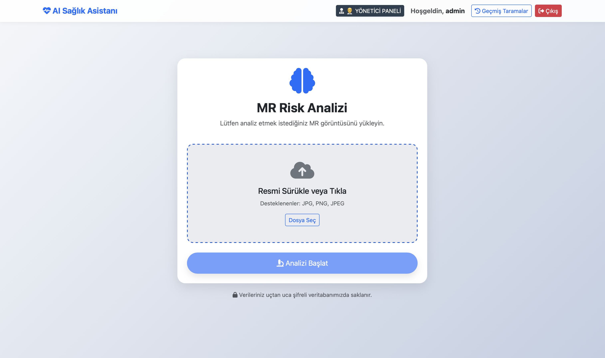
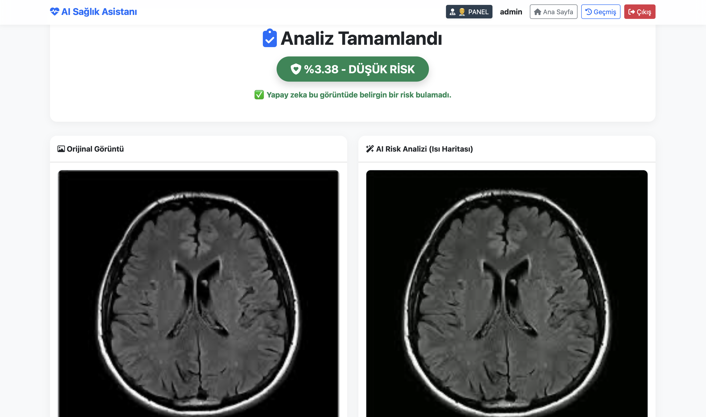
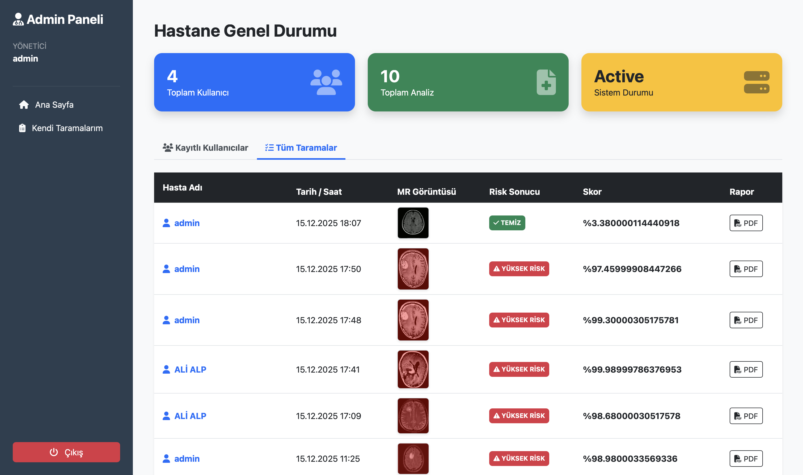

# 🧠 Two-Stage Brain Tumor Detection

> A Flask and TensorFlow-based web application that analyzes brain MRI images using a two-stage AI pipeline to assess tumor risk.


---

## 📌 About

This application analyzes brain MRI images uploaded by users through a two-stage AI pipeline:

1. **MRI Validation Stage** — `mr_validator_model.h5` verifies whether the uploaded image is a real brain MRI. Non-MRI images are rejected before any further processing.
2. **Tumor Risk Scoring Stage** — `cancer_risk_model.h5` performs risk analysis on the validated MRI, generating a percentage risk score and a heatmap overlay highlighting suspicious regions.

Results are automatically converted into a downloadable PDF report and saved to the user's history.

---

## 📸 Screenshots

| Login | Home |
|-------|------|
|  |  |

| Analysis Result | Admin Dashboard |
|-----------------|-----------------|
|  |  |

---

## ✨ Features

- 🔍 **Two-stage AI pipeline** — MRI validation followed by tumor risk scoring
- 🌡️ **Heatmap visualization** — high-risk regions highlighted in red tones
- 📄 **Automatic PDF report** — downloadable official report after every analysis
- 👤 **User system** — registration, login, and personal analysis history
- 🛡️ **Admin dashboard** — view all users and their scans in one panel
- 🔐 **Secure authentication** — passwords hashed with PBKDF2-SHA256
- 📱 **Responsive UI** — mobile-friendly design built with Bootstrap 5
- 🖱️ **Drag & drop upload** — intuitive file upload interface

---

## 🛠️ Tech Stack

| Layer | Technology |
|-------|------------|
| Backend | Python 3.11, Flask, Flask-Login, Flask-SQLAlchemy |
| AI / ML | TensorFlow / Keras, OpenCV, NumPy |
| Database | SQLite |
| Frontend | HTML5, Bootstrap 5, Font Awesome 6, Jinja2 |
| Reporting | FPDF, Pillow |
| Security | Werkzeug (PBKDF2-SHA256) |

---

## 🚀 Getting Started

### Prerequisites

- Python **3.9 – 3.11** (required for TensorFlow compatibility)
- pip

### Installation

```bash
# 1. Clone the repository
git clone https://github.com/fatihhaktas/Two-Stage-Brain-Tumor-Detection.git
cd Two-Stage-Brain-Tumor-Detection

# 2. Create and activate a virtual environment
py -3.11 -m venv venv

# Windows
venv\Scripts\activate

# macOS / Linux
source venv/bin/activate

# 3. Install dependencies
pip install -r requirements.txt

# 4. Run the application
python app.py
```

Open your browser and navigate to: **http://127.0.0.1:5002**

---

## 🔄 Application Flow

```
User uploads MRI image
        ↓
[Stage 1] mr_validator_model.h5
  → Not an MRI: ⛔ "Analysis Rejected"
  → Valid MRI:  ✅ proceed
        ↓
[Stage 2] cancer_risk_model.h5
  → Risk score calculated (0–100%)
  → Heatmap image generated
        ↓
PDF report generated
        ↓
Result saved to database
        ↓
Result page displayed to user
```

---

## 🗄️ Database Models

**User**
```
id | username | password (hashed) | is_admin
```

**Report**
```
id | date | original_path | processed_path | pdf_path | risk_score | risk_label | user_id (FK)
```

---

## ⚠️ Important Notes

- This application is intended for **academic and educational purposes only** and must not be used for medical diagnosis.
- The `SECRET_KEY` in `app.py` must be replaced with a strong random key before deploying to production.
- TensorFlow does not support Python 3.12 or later. Python **3.11** is strongly recommended.

---

## 📄 License

This project is licensed under the [MIT License](LICENSE).

---

## 👨‍💻 Developer

**Fatih Aktaş**
- GitHub: [@fatihhaktas](https://github.com/fatihhaktas)

⭐ If you found this project helpful, please give it a star! ⭐
